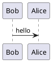

# Cassandra

## Keyspace, Replication, Table 

* Partition Key: Cassandra tables use two additional kinds of keys. A partition key is used to determine which node in the cluster to store a row in. 
* Keyspace: It is like a schema in RDBMS and has tables, indexes and other data structures. It also defines replication strategy.

### Replication Strategy
* Simple Replication Strategy - It is used to sets a number of replicas when all nodes will be in a single data center.
* Netwrk Topology Replication - It is used to set a numberof replicas when nodes will be distributes in multiple data centers.
Both of strategies take a number of replicas as a parameter - `replication_factor`.

### Keyspace definition example
```sql
CREATE KEYSPACE
  perfmonitor
WITH
  replication = { 'class': SimpleStrategy',
                  'replication_factor': 3};
```

### Table definition example
```sql
CREATE TABLE app_instance (
  id uuid,
  app_name text,
  proc_id text,
  host_id text,
  os_priority int,
  cpu_time int,
  num_io_ops int,
  PRIMARY KEY (id))
```

### Basic types

* Int
* Text
* Float
* Timestamp
* Date
* Blob
* UUID

### Collection data types

* List - a collection of one or more elements
* Map - a group of key-value pairs
* Set - a collection of one or more elements with no duplicates

### Table with Collections example
```sql
CREATE TABLE app_instance (
  id uuid,
  app_name text,
  proc_id text,
  host_id text,
  os_priority map<text, int>,
  cpu_time int,
  num_io_ops int,
  PRIMARY KEY (id))
```

### Table with primary key
We assume that the process ID and host ID uniquely identify an application instance.
First attribute (host ID) in the primary key is used asthe partion key, which determines how data is ordered on the disk. It is needed to choose a primary key carefully because it is used to retrieve data using select statements.
```sql
CREATE TABLE app_instance (
  id uuid,
  app_name text,
  proc_id text,
  host_id text,
  os_priority map<text, int>,
  cpu_time int,
  num_io_ops int,
  PRIMARY KEY (host_id, proc_id))
```

### Clustering order
This option is used to change the default sort order of rows on the disk, wwhen wecreate tables.
Cassandra does not provide a mechanism to srt query results at query time, so we have to consider sort order when creating a table.
```sql
CREATE TABLE app_instance (
  id uuid,
  app_name text,
  proc_id text,
  host_id text,
  os_priority map<text, int>,
  cpu_time int,
  num_io_ops int,
  PRIMARY KEY (host_id, proc_id))
  WITH CLUSTERING ORDER BY (proc_id DESC)
```




## Kafka Theory

### Topics
* a particular stream of data
* similar to a table in a database
* identified by its **name**
* split in **partitions**
    * each partion is ordered
    * each message within a partion gets an incremantal id, called **offset**

 Topic has 3 partitions (0, 1, 2), for exmaple.


### Broker

* Kafka cluster is composed of multiple brokers (servers)
* Identifed with its ID (integer)
* Each broker contains certain topic partitions  
  (has some data not whole data)
* Good number to get started is 3 broker, bt some big clusters have over 100 brokers

### Brokers & Topics
* Broker 101, 102, 103
* Topic_A with 2 partitions
* Topic_B with 3 partitions

### Topic Replication Factor 

In Sync Replica

### Producer
* Writes data to topics
* Automacally knows to which broker and partition to write to
    * acks=0: P will not wait for ack
    * acks = 1: P will wait for leader ack (limited data loss)
    * acks=all: leader + replicas acknowledgement (no data less)

### Message keys
* 

### Consumers
* Reads data from a topic 
* Data isread in order **within each partitions** 

### Consumers Groups 

### Consumer Offsets
* Kafa stores the offsets at which a consumer group has been reading, like bookmarking.
* sdd

### Delivery Semantics from Consumers
* At most once
* At least once (usually preferred)
* Exactly once

### Kafka Broker Discovery
Only need to connect on broker


### Zookeeper
* manages brokers
* helps in performing leader election for partitions
* Sends notifications to Kafka 
* Kafka can't work without Zookeeper

## Installation


```plantuml
@startuml component
actor client
node app
database db

db -> app
app -> c lient
@enduml
```


first_topic
bash-4.4# ./kafka-topics.sh --zookeeper zookeeper:2181 --topic first_topic first_topic --describe
Topic: first_topic	PartitionCount: 3	ReplicationFactor: 1	Configs:
	Topic: first_topic	Partition: 0	Leader: 1001	Replicas: 1001	Isr: 1001
	Topic: first_topic	Partition: 1	Leader: 1001	Replicas: 1001	Isr: 1001
	Topic: first_topic	Partition: 2	Leader: 1001	Replicas: 1001	Isr: 1001
bash-4.4# ./kafka-topics.sh --zookeeper zookeeper:2181 --topic second_topic --create --partitions 6 --replication-factor 1
WARNING: Due to limitations in metric names, topics with a period ('.') or underscore ('_') could collide. To avoid issues it is best to use either, but not both.
Created topic second_topic.

bash-4.4# ./kafka-topics.sh --zookeeper zookeeper:2181 --list
first_topic
bash-4.4# ./kafka-topics.sh --zookeeper 172.20.0.2:2181 --list
first_topic
bash-4.4# ./kafka-topics.sh --zookeeper zookeeper:2181 --topic first_topic first_topic --describe
Topic: first_topic	PartitionCount: 3	ReplicationFactor: 1	Configs:
	Topic: first_topic	Partition: 0	Leader: 1001	Replicas: 1001	Isr: 1001
	Topic: first_topic	Partition: 1	Leader: 1001	Replicas: 1001	Isr: 1001
	Topic: first_topic	Partition: 2	Leader: 1001	Replicas: 1001	Isr: 1001
bash-4.4# ./kafka-topics.sh --zookeeper zookeeper:2181 --topic second_topic --create --partitions 6 --replication-factor 1
WARNING: Due to limitations in metric names, topics with a period ('.') or underscore ('_') could collide. To avoid issues it is best to use either, but not both.
Created topic second_topic.