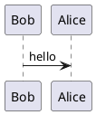

# Cassandra

## Cassandra Architecture
### Keyspace, Replication, Table 

* Partition Key: Cassandra tables use two additional kinds of keys. A partition key is used to determine which node in the cluster to store a row in. 
* Keyspace: It is like a schema in RDBMS and has tables, indexes and other data structures. It also defines replication strategy.

### Replication Strategy
* Simple Replication Strategy - It is used to sets a number of replicas when all nodes will be in a single data center.
* Netwrk Topology Replication - It is used to set a numberof replicas when nodes will be distributes in multiple data centers.
Both of strategies take a number of replicas as a parameter - `replication_factor`.

### Keyspace definition example
```sql
CREATE KEYSPACE
  perfmonitor
WITH
  replication = { 'class': SimpleStrategy',
                  'replication_factor': 3};
```

### Table definition example
```sql
CREATE TABLE app_instance (
  id uuid,
  app_name text,
  proc_id text,
  host_id text,
  os_priority int,
  cpu_time int,
  num_io_ops int,
  PRIMARY KEY (id))
```

### Basic types

* Int
* Text
* Float
* Timestamp
* Date
* Blob
* UUID

### Collection data types

* List - a collection of one or more elements
* Map - a group of key-value pairs
* Set - a collection of one or more elements with no duplicates

### Table with Collections example
```sql
CREATE TABLE app_instance (
  id uuid,
  app_name text,
  proc_id text,
  host_id text,
  os_priority map<text, int>,
  cpu_time int,
  num_io_ops int,
  PRIMARY KEY (id))
```

### Table with primary key
We assume that the process ID and host ID uniquely identify an application instance.
First attribute (host ID) in the primary key is used asthe partion key, which determines how data is ordered on the disk. It is needed to choose a primary key carefully because it is used to retrieve data using select statements.
```sql
CREATE TABLE app_instance (
  id uuid,
  app_name text,
  proc_id text,
  host_id text,
  os_priority map<text, int>,
  cpu_time int,
  num_io_ops int,
  PRIMARY KEY (host_id, proc_id))
```

### Clustering order
This option is used to change the default sort order of rows on the disk, wwhen wecreate tables.
Cassandra does not provide a mechanism to srt query results at query time, so we have to consider sort order when creating a table.
```sql
CREATE TABLE app_instance (
  id uuid,
  app_name text,
  proc_id text,
  host_id text,
  os_priority map<text, int>,
  cpu_time int,
  num_io_ops int,
  PRIMARY KEY (host_id, proc_id))
  WITH CLUSTERING ORDER BY (proc_id DESC)
```



